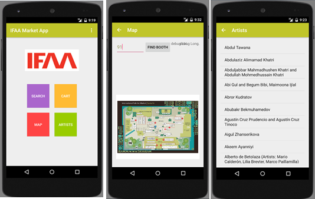

# ifaa-android-app
Android app for International Folk Art Market

Initial test code for a standalone mobile app to assist in the market experience at the International Folk Art Market in Santa Fe, NM each July.
#Goal
To provide visitors with an app that gives information they want to know about artist coming to the International Folk Art Market. Additional Features may include a guide around the market. All of this will be available freely on a touch of a button from a smartphone application.
#Design
4 Main Functions.

##Compass/Map 
To help guide visitors around the market.

##Search option
Users can search by Categories, Counties, and New Artists.  Categories include any medians of art (Jewelry, Metalwork, Basketry, etc)

##Artist Profiles
So that visitors can gain a deeper understanding of the art, how it’s made, artist’s culture, country, and more.

##Cart
On every artist profile, there will be a button for sale slips. If a visitor has bought some sort of art by an artist, they can go to the artist’s profile page on the app and click the button. This will set off a timer for 3:00:00 (the time for the customer to come back and pick up his/her art). You can manage purchases from the cart option on the app.

#Screen Shots
  
 
#Credits
Written by Luke Karns (Mandela International Magnet School, Inspire SF protégé) & Kevin Karns, with a lot of help from training classes at Lynda.

Find Kevin on:

•	Twitter: http://twitter.com/kkarns

•	Github: https://github.com/kkarns     

For more on the International Folk Art Market:

•	Website: https://www.folkartalliance.org 

•	Twitter: https://twitter.com/FolkArtAlliance 

Additional Credits:

•	Rahul Patle, co-mentor, co-developer on the iOS platform in Swift, a parallel effort.

•	Hilary Kilpatric, IFAA Associate Director of Artist Development and Social Impact and mentor. 

